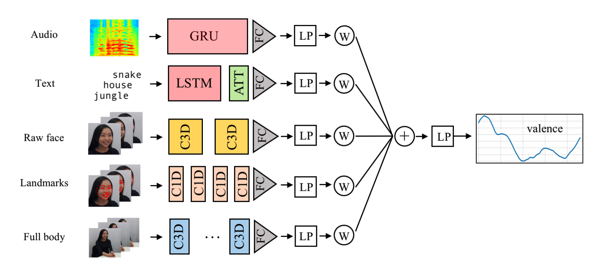

# OMG Empathy Challenge 2019

&nbsp;
&nbsp;
&nbsp;
&nbsp;
&nbsp;

This is an ensemble multimodal model developed for the [OMG Empathy Challenge 2019](https://www2.informatik.uni-hamburg.de/wtm/omgchallenges/omg_empathy2018_results2018.html#) by the **Alpha - City team** (collaboration of [Telefónica Innovation Alpha, Barcelona, Spain](https://www.alpha.company/), and [MIRG - City, University of London, UK](http://mirg.city.ac.uk/)).

This model integrates predictions from different sources (video, audio, and dialogue transcript). To run the full model, each individual module needs to be run separately and the prediction of each of them integrated using one of the proposed methods (Regression model, Smoothed weighted average model or K-nearest Neighbours Model).

The overall diagram of the model is the following:

### Hardware Acceleration Notes (Fullbody)
- Apple Silicon: install `tensorflow-macos` + `tensorflow-metal` to enable GPU via Metal, then set `"device": "auto"` or `"gpu"` in `fullbody/config.json`.
- NVIDIA CUDA: install a CUDA-enabled TensorFlow build for your OS/driver (see TensorFlow GPU docs), then set `"device": "auto"` or `"gpu"` in `fullbody/config.json`.

### Overview of the Pipeline
The pipeline you're working with is part of the OMG Challenge 2018 submission code for a transcript-based emotion recognition model using emotional lexicons. It processes spoken story transcripts (from SRT files) and ground-truth valence annotations (from CSV files) to extract features, align them to frame-level data, and train an LSTM model to predict valence (a measure of emotional positivity/negativity) per window of frames.

The goal is to predict continuous valence scores from text features derived from two emotional lexicons: Warriner et al. (providing Valence, Arousal, Dominance - VAD) and DepecheMood (providing 8 emotion categories like AFRAID, AMUSED, etc.), resulting in 11-dimensional features per word.

The pipeline consists of five main scripts, executed in sequence:
1. `create_tsv_from_transcripts.py`: Prepares per-word valence data from transcripts and annotations.
2. `transcript_preprocessing.py`: Extracts lexicon-based features for each word.
3. `convert_csv_to_npy.py`: Converts feature CSVs to NumPy arrays.
4. `upsample.py`: Aligns per-word features to frame-level (matching video frame counts from annotations).
5. `new_lstm.py` (modified from `LSTM.py`): Loads aligned data, applies windowing, and trains the LSTM model.

These scripts assume:
- Input directories: `data/srt/` for SRT transcripts, `data/original_dataset/annotations/` for valence CSVs, and lexicon files in `./lexicons/`.
- Output directories: `data/text/word_valence/` for TSVs, `../data/text/lexicons_features/` for CSVs, `vectors/val2/text/` for .npy files, and `vectors/val2/text_aligned/` for aligned .npy files.
- Data for subjects 1–10 and stories 1–5 (but configurable, e.g., limited to subject 1/story 1 in your setup).

The process handles 9250 frames per story (based on your outputs), assuming a video FPS of ~25 and story durations of ~6–7 minutes. I'll explain each step in detail, including how data flows, key operations, and any modifications we made (e.g., to fix errors in `LSTM.py`).

### Step 1: create_tsv_from_transcripts.py - Generating Per-Word Valence TSVs
**Purpose**: This script converts subtitle transcripts (SRT files) and ground-truth valence annotations (CSV files) into TSV files with one row per word, including the word and its average valence score over the frames it spans.

**Input**:
- SRT files: `data/srt/transcribed_subject_{sub}_story_{st}.srt` (e.g., for subject 1, story 1). These contain timed subtitles with spoken text.
- Annotation CSVs: `data/original_dataset/annotations/Subject_{sub}_Story_{st}.csv` (e.g., 9250 rows of float valence scores, one per video frame, no header).
- Assumes FPS ~25 (computed dynamically from SRT duration and annotation length).

**Key Operations**:
1. **Load Data**:
   - Read valence scores from CSV as a 1D NumPy array (length 9250 in your case).
   - Parse SRT using `pysrt` to get subtitles with start/end times.

2. **Time to Frame Conversion**:
   - Convert SRT timestamps (e.g., "00:00:01,000") to seconds using `time_to_seconds`.
   - Compute effective FPS: `fps = len(valence) / last_subtitle_end_seconds` (fallback to 25 if invalid).
   - Convert seconds to frame indices: `frame = int(seconds * fps)`.

3. **Process Subtitles**:
   - For each subtitle, clean text (remove punctuation, split into words).
   - Calculate start/end frames for the subtitle.
   - Distribute frames across words proportionally (e.g., if subtitle has 5 words and spans 100 frames, each word gets ~20 frames).
   - For each word, compute average valence: `np.mean(valence[start_frame:end_frame])` (fallback to 0.5 if out of bounds).

4. **Output**:
   - Save as TSV: `data/text/word_valence/Subject_{sub}_Story_{st}.tsv` (columns: word, valence; no header).
   - Example row: "hello\t0.65" (tab-separated).

**How It Works in Your Setup**:
- Loops over subjects (1) and stories (1).
- Outputs a TSV with ~number of words in the transcript (e.g., a few hundred per story).
- Handles errors like missing files or non-numeric CSV data (skips or uses fallbacks).
- Data Flow: SRT + Valence CSV → Per-word valence TSV.

**Execution**: Run `python3 create_tsv_from_transcripts.py`. Prints "Saved ... with {num_words} words".

### Step 2: transcript_preprocessing.py - Extracting Lexicon Features
**Purpose**: This script uses two emotional lexicons to generate 11-dimensional feature vectors (3 from Warriner + 8 from DepecheMood) for each word in the TSV from Step 1.

**Input**:
- TSV from Step 1: `../data/text/word_valence/Subject_{sub}_Story_{st}.tsv`.
- Lexicons:
  - `./lexicons/Ratings_Warriner_et_al.csv`: Words with V.Mean.Sum (Valence), A.Mean.Sum (Arousal), D.Mean.Sum (Dominance).
  - `./lexicons/DepecheMood_english_token_full.tsv`: Words with 8 emotions (AFRAID, AMUSED, ANGRY, ANNOYED, DONT_CARE, HAPPY, INSPIRED, SAD).

**Key Operations**:
1. **Load Lexicons**:
   - Read as Pandas DataFrames.

2. **Process Each Story**:
   - Load TSV as DataFrame (word, valence).
   - For each word:
     - Lookup in Warriner lexicon: If found, get VAD values; else, use previous word's values (carry-forward).
     - Lookup in DepecheMood: If found, get 8 emotion values; else, use previous.
     - Concatenate: [VAD (3) + Emotions (8)] = 11 floats.
     - Join as comma-separated string.

3. **Output**:
   - Save as CSV: `../data/text/lexicons_features/Subject_{sub}_Story_{st}_lex.csv` (one row per word, 11 comma-separated values, no header).
   - Example row: "5.0,6.0,4.0,0.1,0.2,0.3,0.4,0.5,0.6,0.7,0.8".

**How It Works in Your Setup**:
- Loops over subjects (1–10) and stories (1–5), but configurable.
- Handles missing lookups with carry-forward to avoid gaps.
- Data Flow: Per-word valence TSV + Lexicons → Per-word 11D feature CSV.

**Execution**: Run `python3 transcript_preprocessing.py`. Prints output filenames.

### Step 3: convert_csv_to_npy.py - Converting CSVs to NumPy Arrays
**Purpose**: Converts the lexicon feature CSVs from Step 2 to .npy format for efficient loading. References a window size of 100 (per Barbieri et al., 2019), but doesn't apply windowing here.

**Input**:
- CSVs: `../data/text/lexicons_features/Subject_{sub}_Story_{st}_lex.csv`.

**Key Operations**:
1. **Load and Convert**:
   - Read CSV as Pandas DataFrame (no header).
   - Convert to NumPy array (shape: num_words x 11).

2. **Output**:
   - Save as .npy: `vectors/val2/text/Subject_{sub}_Story_{st}.npy`.

**How It Works in Your Setup**:
- Loops over subjects (1–10) and stories (1–5), but configurable (e.g., limited to 1/1).
- Handles missing files with print statements.
- Data Flow: Per-word feature CSV → Per-word 11D .npy array (e.g., shape (300, 11) if 300 words).

**Execution**: Run `python3 convert_csv_to_npy.py`. Prints "Saved ..." or "Missing ...".

### Step 4: upsample.py - Upsampling to Frame-Level Alignment
**Purpose**: Upsamples per-word features to match the frame-level valence annotations (e.g., 9250 frames), creating frame-aligned .npy files for model input.

**Input**:
- Lexicon CSVs from Step 2 (num_words x 11).
- Annotation CSVs (num_frames x 1 valence, e.g., 9250).

**Key Operations**:
1. **Load Data**:
   - Features: Pandas to NumPy (num_words x 11).
   - Frame count: Length of valence CSV (skip header if present).

2. **Upsampling**:
   - Approximate frames per word: `num_frames // num_words`, with remainder distributed.
   - Create aligned array (num_frames x 11).
   - Repeat each word's features for its allocated frames.
   - Pad remaining frames with mean features (or neutral 0.5).

3. **Output**:
   - Save as .npy: `vectors/val2/text_aligned/Subject_{sub}_Story_{st}_aligned.npy` (shape: 9250 x 11).

**How It Works in Your Setup**:
- Loops over subjects/stories.
- Assumes even distribution (simplified; could use SRT timings for precision).
- Data Flow: Per-word features + Frame count → Frame-level features .npy.

**Execution**: Run `python3 upsample.py`. Prints "Aligned (9250, 11) for ...".

### Step 5: new_lstm.py (Modified LSTM.py) - Training the Model
**Purpose**: Loads aligned frame-level features, applies windowing, and trains an LSTM model with subject embeddings to predict valence per window.

**Input**:
- Aligned .npy: `vectors/val2/text_aligned/Subject_{sub}_Story_{st}_aligned.npy` (9250 x 11).
- Annotations: Valence CSVs (9250 floats).

**Key Operations** (with Modifications We Made):
1. **Hyperparameters**:
   - Subjects/stories: Limited to [1]/[1] for train/val.
   - `window_size=100`, `stride=50` (added for overlapping windows).
   - `embedding_size=11`, `lr=0.0001`, `batch_size=500` (adjustable).
   - Model: LSTM with optional attention, subject embedding (size 2), dense layers.

2. **Data Loading and Windowing**:
   - Load frame-level X (9250 x 11) and Y (9250) per subject/story.
   - Global smooth/normalize Y (if enabled).
   - Window: For each story, slide windows of 100 frames with stride 50, creating ~184 windows.
   - For each window: X_win = features slice (100 x 11), Y_win = mean valence.
   - Repeat subject index (sub_idx, e.g., 0 for subject 1) for each window.
   - Result: X_train (184 x 100 x 11), Y_train (184), X_train_late_subject (184).

3. **Model Architecture**:
   - Inputs: Subject ID (int), Sequence (100 x 11).
   - Dropout on sequence.
   - LSTM (64 units, return sequences if attention).
   - Optional AttentionWeightedAverage.
   - Embed subject (Embedding 11->2, flatten).
   - Concatenate LSTM output + subject embedding.
   - Dense (32, ReLU), Dropout, Dense(1).
   - Loss: 1 - CCC (custom `ccc_error`).

4. **Training**:
   - Optimizer: Adam (lr=0.0001).
   - Callbacks: Metrics (computes CCC/Pearson on val per epoch), EarlyStopping (patience=5 on val_loss), ModelCheckpoint (best weights), TensorBoard.
   - Fit: [subject_ids, sequences] -> Y, with val data.
   - We fixed: Backend imports, deprecated args, validation data in callback, shape mismatches, indexing errors.

5. **Post-Training**:
   - Load best weights.
   - Predict on val.
   - Apply `f_trick`: Normalize predictions using train stats.
   - Compute CCC/Pearson.
   - Plot Y_val vs. preds vs. preds_tricks.

**How It Works in Your Setup**:
- Processes 1 subject/story, windowing 9250 frames to 184 samples.
- Trains until early stopping (e.g., after a few epochs if val_loss plateaus).
- Outputs metrics (e.g., CCC ~0.375) and plot.
- Data Flow: Frame-level .npy + Valence CSV → Windowed data → Trained model + Predictions.

**Execution**: Run `python3 new_lstm.py`. Prints shapes, per-epoch metrics, final metrics, and shows plot.

### Full Pipeline Execution
1. Run each preprocessing script in order.
2. Run `new_lstm.py` for training.
3. If expanding data, rerun preprocessing for all subjects/stories, then train with updated params.

This pipeline is now robust, with fixes for compatibility, shapes, and errors. If you add more data or tweak params (e.g., `batch_size=32`, `patience=20`), it should train longer and potentially improve metrics. Let me know if you need further tweaks!
