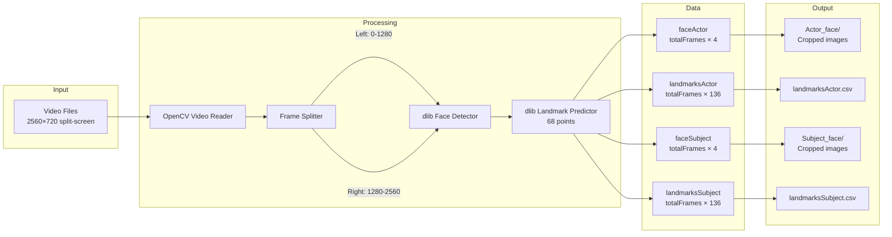
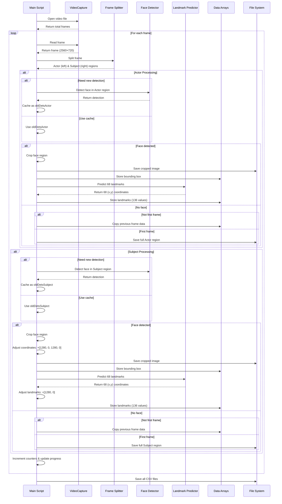

# Facial Landmarks Extraction Flow

```mermaid
flowchart TD
    Start([Start Processing]) --> Init[Initialize dlib detector and predictor]
    Init --> LoadVideos[Load and sort video files]
    LoadVideos --> VideoLoop{For each video}
    
    VideoLoop --> CopyVideo[Copy video to tmp/current_video.mp4]
    CopyVideo --> OpenVideo[Open video with cv2.VideoCapture]
    OpenVideo --> GetFrames[Get total frame count]
    GetFrames --> InitArrays[Initialize data arrays]
    InitArrays --> CreateDirs[Create output directories]
    CreateDirs --> InitCounters[Initialize counters]
    
    InitCounters --> FrameLoop{For each frame}
    
    FrameLoop --> ReadFrame[Read frame from video]
    ReadFrame --> FrameOK{Frame read successfully?}
    
    FrameOK -->|Yes| SplitFrame[Split frame into Actor and Subject regions]
    FrameOK -->|No| EndVideo[End of video]
    
    SplitFrame --> ActorProcess[Actor Face Processing]
    SplitFrame --> SubjectProcess[Subject Face Processing]
    
    %% Actor Processing
    ActorProcess --> ExtractActor[Extract left half: img[0:720, 0:1280]]
    ExtractActor --> CheckActorDetect{Need new detection?<br/>lastImageWithFaceDetected > 9?}
    
    CheckActorDetect -->|Yes| RunActorDetect[Run dlib face detector]
    CheckActorDetect -->|No| UseActorCache[Use cached detection]
    
    RunActorDetect --> ActorDetected{Face detected?}
    ActorDetected -->|Yes| CacheActor[Cache detection]
    ActorDetected -->|No| NoActorCache[No cache]
    
    CacheActor --> CropActor[Crop face region]
    NoActorCache --> ActorPrev{Previous frame exists?}
    UseActorCache --> CropActor
    
    CropActor --> SaveActorImg[Save cropped face image]
    SaveActorImg --> StoreActorBox[Store bounding box coordinates]
    StoreActorBox --> DetectActorLandmarks[Detect 68 landmarks]
    DetectActorLandmarks --> StoreActorLandmarks[Store landmarks 136 values]
    
    ActorPrev -->|Yes| CopyActorPrev[Copy previous frame data]
    ActorPrev -->|No| SaveActorFull[Save full Actor region]
    
    CopyActorPrev --> ActorDone[Actor processing done]
    SaveActorFull --> ActorDone
    StoreActorLandmarks --> ActorDone
    
    %% Subject Processing
    SubjectProcess --> ExtractSubject[Extract right half: img[0:720, 1280:2560]]
    ExtractSubject --> CheckSubjectDetect{Need new detection?<br/>lastImageWithFaceDetected > 9?}
    
    CheckSubjectDetect -->|Yes| RunSubjectDetect[Run dlib face detector]
    CheckSubjectDetect -->|No| UseSubjectCache[Use cached detection]
    
    RunSubjectDetect --> SubjectDetected{Face detected?}
    SubjectDetected -->|Yes| CacheSubject[Cache detection]
    SubjectDetected -->|No| NoSubjectCache[No cache]
    
    CacheSubject --> CropSubject[Crop face region]
    NoSubjectCache --> SubjectPrev{Previous frame exists?}
    UseSubjectCache --> CropSubject
    
    CropSubject --> AdjustSubjectCoords[Adjust coordinates: +[1280, 0, 1280, 0]]
    AdjustSubjectCoords --> SaveSubjectImg[Save cropped face image]
    SaveSubjectImg --> StoreSubjectBox[Store bounding box coordinates]
    StoreSubjectBox --> DetectSubjectLandmarks[Detect 68 landmarks]
    DetectSubjectLandmarks --> AdjustLandmarks[Adjust landmarks: +[1280, 0]]
    AdjustLandmarks --> StoreSubjectLandmarks[Store landmarks 136 values]
    
    SubjectPrev -->|Yes| CopySubjectPrev[Copy previous frame data]
    SubjectPrev -->|No| SaveSubjectFull[Save full Subject region]
    
    CopySubjectPrev --> SubjectDone[Subject processing done]
    SaveSubjectFull --> SubjectDone
    StoreSubjectLandmarks --> SubjectDone
    
    %% Continue loop
    ActorDone --> IncrementCounters[Increment imageNumber<br/>Increment lastImageWithFaceDetected]
    SubjectDone --> IncrementCounters
    IncrementCounters --> UpdateProgress[Update progress bar]
    UpdateProgress --> FrameLoop
    
    EndVideo --> SaveActorCSV[Save Actor data to CSV files]
    SaveActorCSV --> SaveSubjectCSV[Save Subject data to CSV files]
    SaveSubjectCSV --> PrintTime[Print processing time]
    PrintTime --> VideoLoop
    
    VideoLoop -->|No more videos| End([End])
    
    style Start fill:#90EE90
    style End fill:#FFB6C1
    style ActorProcess fill:#87CEEB
    style SubjectProcess fill:#DDA0DD
    style RunActorDetect fill:#FFD700
    style RunSubjectDetect fill:#FFD700
    style CropActor fill:#98FB98
    style CropSubject fill:#98FB98
```

## Component Overview



## Sequence Diagram



## Key Features

### Face Detection Optimization
- **Caching Strategy**: Face detection runs every 10 frames (`faceDetectorPrecision = 9`)
- **Performance**: Cached detections reused for intermediate frames
- **Robustness**: Previous frame data copied if detection fails

### Coordinate Systems
- **Actor**: Coordinates relative to left half (0-1280 pixels)
- **Subject**: Coordinates relative to right half, stored as full-frame coordinates (1280-2560 pixels)

### Output Format
- **Bounding Boxes**: CSV with 4 columns `[x1, y1, x2, y2]` per frame
- **Landmarks**: CSV with 136 columns (68 landmarks × 2 coordinates) per frame

### 68 Facial Landmarks
- Jaw: 0-16
- Right eyebrow: 17-21
- Left eyebrow: 22-26
- Nose: 27-35
- Right eye: 36-41
- Left eye: 42-47
- Mouth: 48-67


